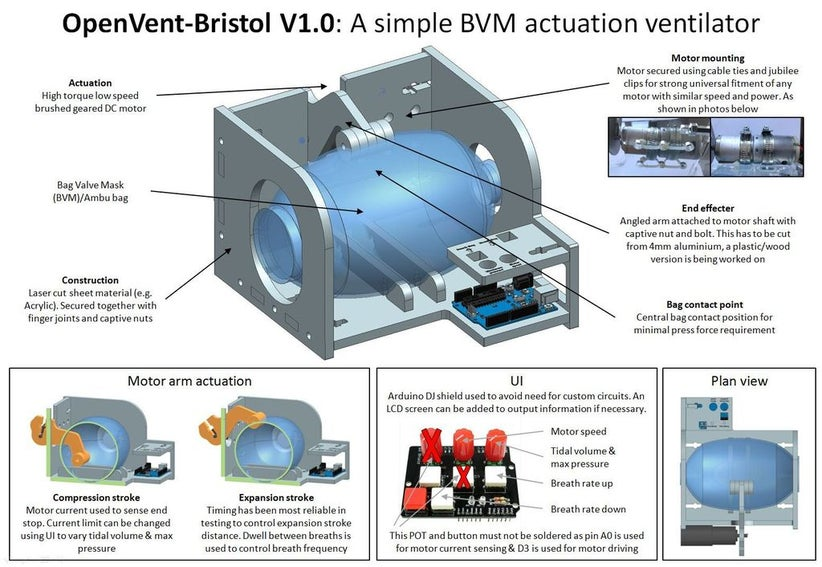

The project link is : [https://www.instructables.com/id/COVID-19-Rapid-Manufacture-Ventilator-BVM-Ambubag-/](https://www.instructables.com/id/COVID-19-Rapid-Manufacture-Ventilator-BVM-Ambubag-/)
The repo  with this documentation can be downloaded following this link: [DOWNLOAD HERE](https://github.com/CombatCovid/OpenVent-Bristol/archive/master.zip)

The USP(Unique Selling Proposition) of this design is how easy and fast it can scale for mass production for the following reasons:

- Automated production: The production of each part is fully automated (laser cutting), with only 8 different parts
- Only 6 off-the-shelf components: Very few different components are needed and no exotic parts are needed (not even a motor coupling)
- Simple mechanism: It uses a super simple mechanism with just an arm mounted to a motor - no complicated mechanisms to go wrong, just one moving part
- Fast assembly: Complete assembly is possible in around 20 min with one person
- Adjustable settings: Has full adjustment of breath frequency and pressure/tidal volume and with a small adaption can function within all NHS requirements
- Low cost

See it here: 

