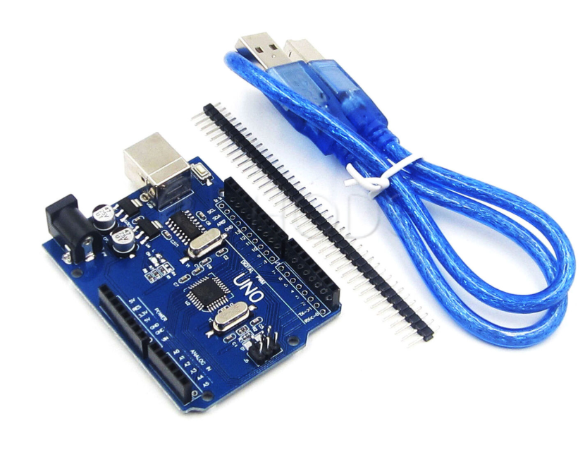
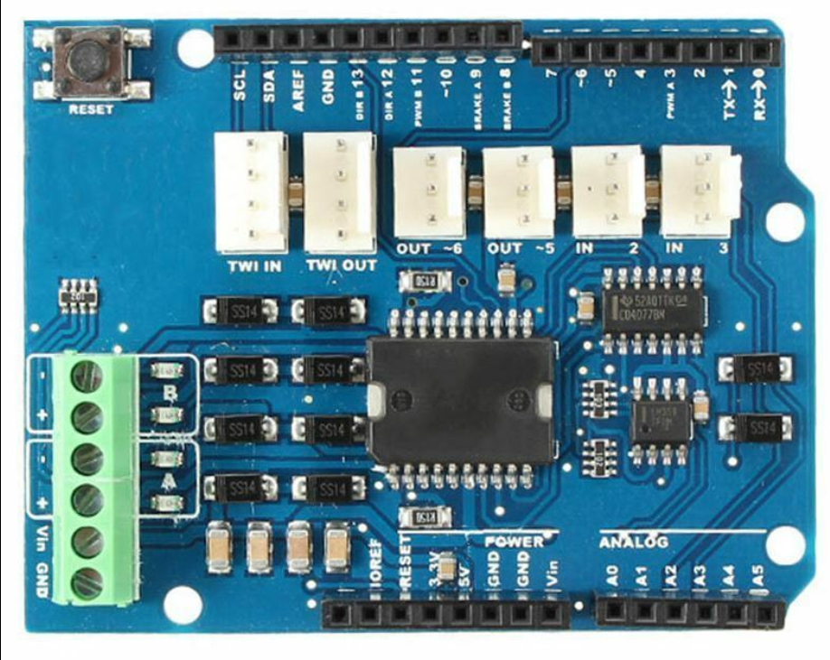
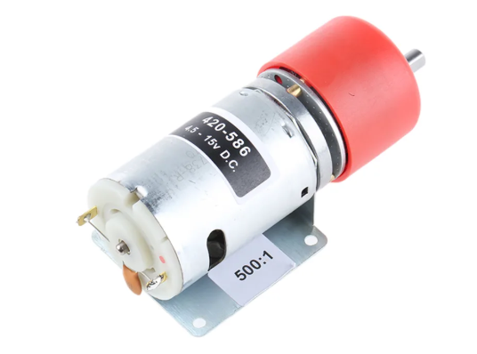
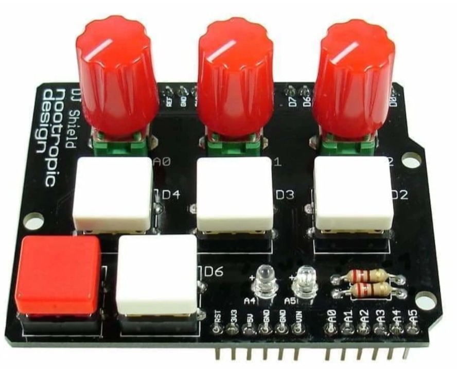
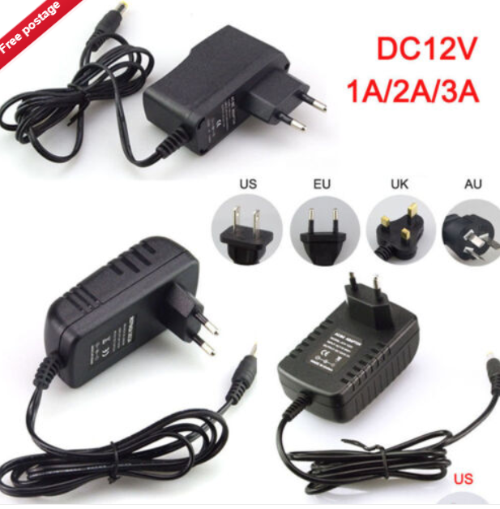
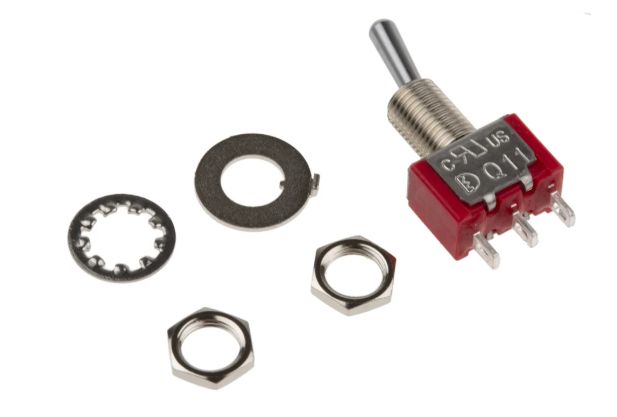

# Instructables 

## Step # 1:Buy the parts
- Arduino Uno £3.00, [buy here](https://www.ebay.co.uk/itm/Mega2560-UNO-R3-ATmega328P-ATemga2560-16AU-Board-CH340G-FT232-Chip-Arduino-UK/202460399703?hash=item2f23948857:m:msxh1rbsMICGKlrlhEPiOeA) (a genuine Uno board was used in the prototype)

- Arduino motor driver shield rev 3 £10,[buy here](https://www.ebay.co.uk/itm/L298P-Shield-R3-DC-Motor-Driver-Module-2A-H-Bridge-2-way-Arduino-UNO-2560-L40/142913731149?hash=item2146527a4d:g:Ju0AAOSwuNFbfdvW)

- Geared DC motor 20-40rpm £24.00,[buy here](https://uk.rs-online.com/web/p/dc-geared-motors/0420586/)

- Arduino Dj shield £16.00 [Buy Here](https://coolcomponents.co.uk/products/dj-shield-standard-kit?_pos=2&_sid=3e205c697&_ss=r)

- Mains to 12 V DC 'wall wart' min 3A £5 [Buy Here](https://www.ebay.co.uk/itm/EU-UK-Universal-DC-12V-1A-2A-3A-Mains-Power-Supply-Adapter-Charger-Transformer/264587958141?hash=item3d9aabd77d:m:miZdzji8t2vXFunw-isefxA)

- On/off switch £1.00 any switch will do, I used a push button latching 16mm panel mount switch, the one in the link is another example 

- 4x cable ties/zip ties (beefier the better)
- 2x jubilee clips 25-40mm
- 9x M6x25mm bolts
- 4x M6x15mm bolts
- 13x M6 nuts
- 1x niloc M6 nut
- 1x M8 x 40mm bolt
- 1x M8 nut
- Laser cut 8mm acrylic parts for chassis £10-£30 (depending on how friendly your local laser cutting place is)
- Laser cut 3mm aluminium motor arm £5-20£ (depending on how friendly your local laser cutting place is)Totaling around £80 (excluding the medical parts; BVM etc.)

- DXFs for laser cutting are stored on GrabCAD in this link: [https://grabcad.com/library/covid-19-rapid-manufacture-ventilator-bvm-ambubag-openvent-bristol-2](https://grabcad.com/library/covid-19-rapid-manufacture-ventilator-bvm-ambubag-openvent-bristol-2)
- Other things not listed here that you will need for treating COVID-19 are a PEEP valve with valve ring adapter, a mask extension tube and a soft Velcro mask strap.

**- A list of improvements for the next version is kept in the GitHub readme, some of those things are below:**

- A 12V battery backup with at least 20 min run time
- A battery management circuit to automatically switch over to the battery in a power cut
- A pressure sensor alarm for sensing failure and a buzzer & LED to create an alert
- An LCD screen to show pressure and other values and settings
