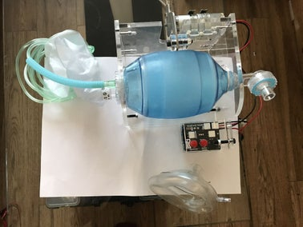
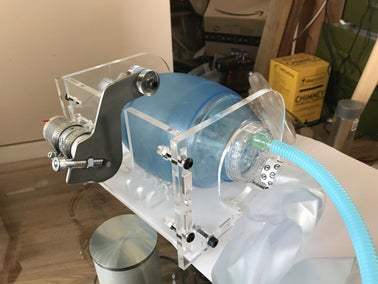
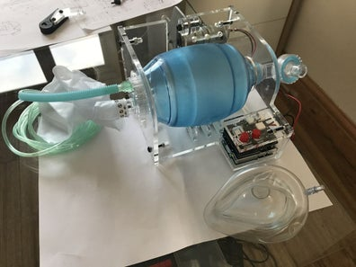
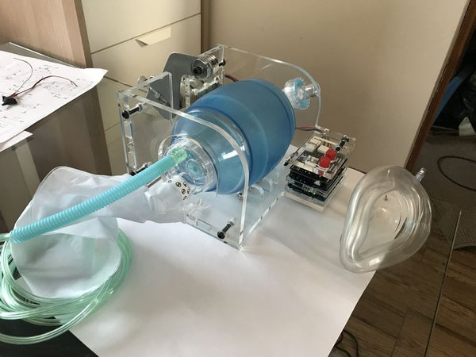
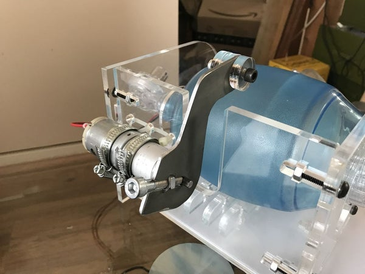
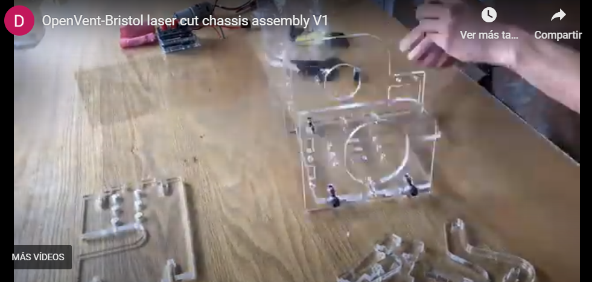

# Step 2: Laser Cut and Assemble Chassis











DXF files and STEP file of the assembly are stored on GrabCAD in this link: [https://grabcad.com/library/covid-19-rapid-manufacture-ventilator-bvm-ambubag-openvent-bristol-2](https://grabcad.com/library/covid-19-rapid-manufacture-ventilator-bvm-ambubag-openvent-bristol-2)

Laser cut the following part files from 8mm acrylic or ply with the following quantities:

- Q1x "Back plate.dxf"
- Q1x "Left side big hole.dxf"
- Q1x "Base plate.dxf"
- Q1x "Arduino DJ shield cover V2.dxf"
- Q1x "right side small hole.dxf"
- Q4x "arm contact ring 25mm.dxf"
- Q2x "Base fins"

**All these parts are in the ```SRC FOLDER``` in the root of the repo**
To assemble you will need:

1. 9x M6x25mm bolts
2. 4x M6x15mm bolts
3. 14x M6 nuts

Watch this video for time-lapse assembly and refer to photos for what it should look like. Apologies for the poor quality and note I was using a older design of motor mount in this video which has been updated, see next step for up to date motor mount method.

### A video about how to assembly the parts

[](https://youtu.be/DLQxyWLqXpQ)