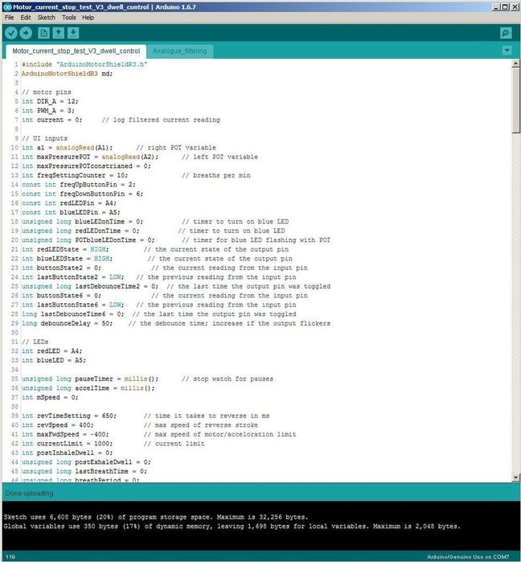

# Step 3 : Mount the motor

As shown in the pictures;

- attach 4 cable ties (the beefier the better) through the 6 holes in the back plate such that 4 of them sit parallel to each other in the horizontal axis
- then pass 2 jubilee clips (I used 25-40mm clips) through the loops in the cable ties and around the motor.
- Then tighten the clips until it grips the motor nicely, but don't tighten it too much!!! Because it can crush the casing and damage the motor.

# Step 4: Mount motor arm

Attach the motor arm using the M8 nut and bolt. Hold the nut in its 'captive' slot and tighten the bolt up against the flat of the motor shaft with a hex key.

Attach some of the small laser cut circles to the end of the arm with the long M6 bolt and nut to distribute the pressing force on the bag. It is best to use a niloc M6 nut if you have one here. You may also want to add some bubble wrap or fabric around the end of the arm for extra cushioning as it may wear into the bag over extended use.

# Step 5: Electronics

- Connect up the motor to motor port A of the motor driver shield
- Connect up the 12V power supply to the Vin connections of the motor driver shield (don't be tempted to plug your power supply direct into the Arduino board, it doesn't seem to like this)
- Connect up your switch in line with the power supply and mount your switch into the 6.35mm hole in the side panel
- Solder up your DJ shield but take care to only solder the components listed below as pins A0 and D3 are needed by the motor driver
- The POT on A1
- The POT on A2
- The button on D6
- The button on D2
- Stack the motor driver shield and the DJ shield on top of the Arduino and secure them in place with the laser cut UI panel using an M6 nut and bolt

# Step 6: Software

Download the latest version of my Arduino code from GitHub using the following link: https://github.com/RealFreshRate/OpenVent/tree/master/Motor_current_stop_test

- Upload the code to the board but before you run it for the first time **make sure the "max pressure/tidal volume" POT is dialed all the way down (all the way anti clockwise).**

- **Once you run it for the first time be prepared to stop it quickly because you have a 50/50 chance that the motor is spinning in the right direction.**
- If the motor trys to spin the wrong way initially then swap the motor wires around to reverse the polarity, if that doesn't work then gradually increase the current limit by dialing up the "max pressure" POT because bigger motors could be tripping out of the current limit upon startup.
-  I think the current limit range on the POT is from 800mA to 1.2A.

# Step 7 :  Enjoy!

Don't forget to add you PEEP valve and mask extension tube, then test and enjoy!

There is a running list of improvements we are keeping for the next version on the GitHub readme: https://github.com/RealFreshRate/OpenVent
